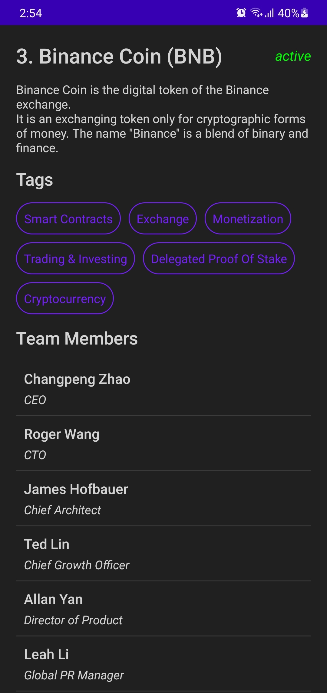

# 💰 Cryptocurrency App 💸

Built a clean architecture app in Android using Jetpack Compose.

Used Retrofit to make network calls to an API.

Used: MVVM, Use Cases, Jetpack Compose, Dependency Injection with Dagger Hilt.

Coin Paprika API:
[coinpaprika.com](https://coinpaprika.com/)

## ✨ Preview:

   
